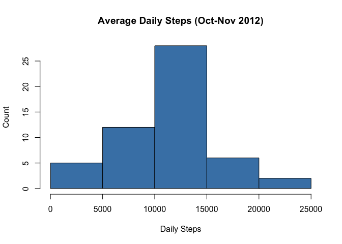
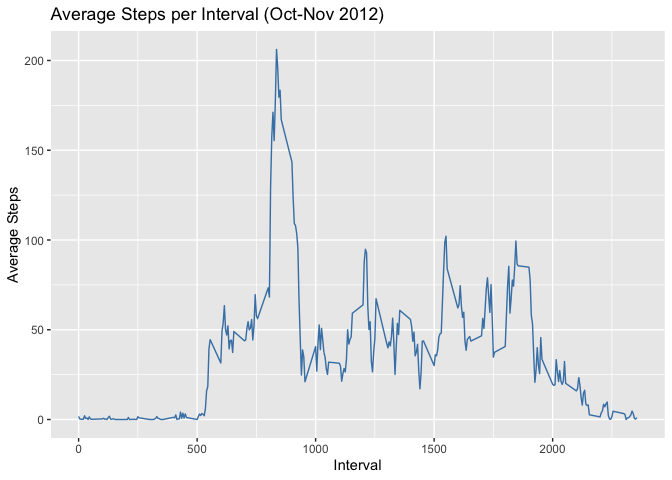
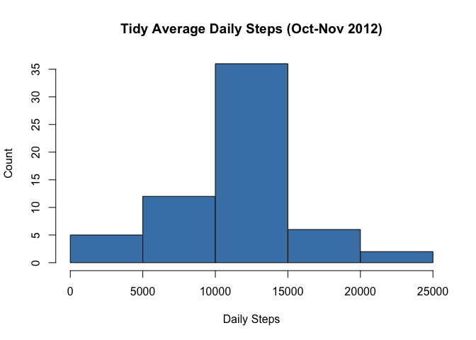
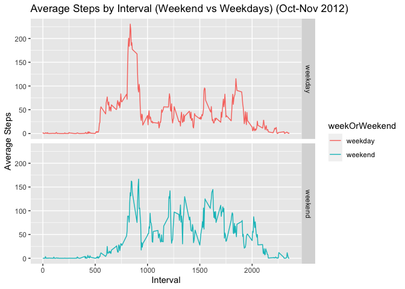

## Introduction
This R Markdown document has been created for the JHU Data Science Specialization 
course Reproducible Research:  Peer Assessment 1 Assignment. There are 5 primary 
questions to be answered with guided questions/steps for each question.


## Data
This assignment makes use of data from a personal activity monitoring
device. This device collects data at 5 minute intervals through out the
day. The data consists of two months of data from an anonymous
individual collected during the months of October and November, 2012
and include the number of steps taken in 5 minute intervals each day.

This data was provided to students through the GitHub repository used as the
basis for the assignment with a filename of activity.zip.


## Loading packages & functions used globally

```r
options(scipen = 999)
library(ggplot2)
```


## Loading and preprocessing the data
Unzip and read the CSV data file

```r
unzip("activity.zip",exdir="data")
activity <- read.csv("./data/activity.csv")
activity$date <-as.Date(activity$date)
```


## What is mean total number of steps taken per day?
For this part of the assignment, missing valus can be ignored.

1. Calculate the total number of steps taken per day

```r
dailySteps <- aggregate(steps ~ date, activity, sum)
head(dailySteps)
```

```
##         date steps
## 1 2012-10-02   126
## 2 2012-10-03 11352
## 3 2012-10-04 12116
## 4 2012-10-05 13294
## 5 2012-10-06 15420
## 6 2012-10-07 11015
```

2. Make a histogram of the total number of steps taken each day

```r
hist(dailySteps$steps, xlab = "Daily Steps", ylab = "Count", 
     main = "Average Daily Steps (Oct-Nov 2012)", col = "steelblue")
```

<!-- -->

3. Calculate and report the mean and median of the total number of steps taken 
per day

```r
meanSteps <- round(mean(dailySteps$steps, na.rm=TRUE), digits = 2)
medianSteps <- round(median(dailySteps$steps, na.rm=TRUE),digits = 2)
```
| Mean Steps   | Median Steps  |
|-------------:|--------------:|
| 10766.19|10765|


## What is the average daily activity pattern?
1. Make a time series plot (type = "l") of the 5-minute interval (x-axis) and 
the average number of steps taken, averaged across all days (y-axis)

```r
intervalSteps <- aggregate(steps ~ interval, activity, mean)

ggplot(intervalSteps, aes(x = interval, y=steps)) + 
        geom_line(color="steelblue") + 
        labs(title = "Average Steps per Interval (Oct-Nov 2012)", 
             x = "Interval", y = "Average Steps")
```

<!-- -->

2. Which 5-minute interval, on average across all the days in the dataset, 
contains the maximum number of steps?

```r
intervalSteps[which.max(intervalSteps$steps),1]
```

```
## [1] 835
```

## Imputing missing values
1. Caclulate and report the total number of missing values in the dataset
(i.e. the toal number of rows with NA)

```r
sum(is.na(activity$steps))
```

```
## [1] 2304
```

```r
sum(is.na(activity$date))
```

```
## [1] 0
```

```r
sum(is.na(activity$interval))
```

```
## [1] 0
```

2. Devise a strategy for filling in all of the missing values in the dataset. The 
strategy does not need to be sophistcated. For exmple, you could use 
the mean/median for that day or the mean for that 5-minute interval

```r
##replace NA values with the mean steps per corresponding interval 
library(dplyr)
```

```
## 
## Attaching package: 'dplyr'
```

```
## The following objects are masked from 'package:stats':
## 
##     filter, lag
```

```
## The following objects are masked from 'package:base':
## 
##     intersect, setdiff, setequal, union
```

```r
library(tidyr)
activityTidy <- activity %>% 
  group_by(interval) %>% 
  mutate_at(vars(steps), ~replace_na(., round(mean(., na.rm = TRUE),digits=0)))
```

3. Create a new dataset that is equal to the original dataset but with the 
 missing data filled in

```r
##convert tibble created above to dataframe and write new dataset
activityTidy <- as.data.frame(activityTidy)
head(activityTidy,10)
```

```
##    steps       date interval
## 1      2 2012-10-01        0
## 2      0 2012-10-01        5
## 3      0 2012-10-01       10
## 4      0 2012-10-01       15
## 5      0 2012-10-01       20
## 6      2 2012-10-01       25
## 7      1 2012-10-01       30
## 8      1 2012-10-01       35
## 9      0 2012-10-01       40
## 10     1 2012-10-01       45
```

```r
write.csv(activityTidy, "./data/activityTidy.csv", row.names=FALSE)
```

4. Make a histogram of the total number of steps taken each day and calculate 
and report the mean and median total number of steps taken per day.
Do these values differ from the estimates from the first part of the assignment?
What is the impact of imputing missing data on the estimates of the total 
daily number of steps?

```r
dailyTidy <- setNames(aggregate(steps ~ date, activityTidy, sum), c("date","steps"))
hist(dailyTidy$steps, xlab = "Daily Steps", ylab = "Count", 
     main = "Tidy Average Daily Steps (Oct-Nov 2012)", col = "steelblue")
```

<!-- -->


```r
meanTidy <- round(mean(dailyTidy$steps, na.rm=TRUE),digits = 2)
medianTidy <- round(median(dailyTidy$steps, na.rm=TRUE),digits = 2)
```

|Data Set                 | Mean Steps   | Median Steps  |
|:------------------------|-------------:|--------------:|
|Activity with NAs        | 10766.19|10765|
|Tidy Activity witout NAs | 10765.64 |10762 |


## Are there differences in activity patterns between weekdays and weekends?
1. Create a new factor varaible in the dataset with two levels - "weekday"
and "weekend" indicating whether a given date is a weekday or weekend day.

```r
##Find day of the week for dates
activityTidy$dayOfWeek <- weekdays(activityTidy$date)

##Classify days of the week
weekendDays <- c("Sunday","Saturday")
activityTidy$weekOrWeekend <- factor(ifelse(activityTidy$dayOfWeek %in% weekendDays, "weekend", "weekday")) 
head(activityTidy, 10)
```

```
##    steps       date interval dayOfWeek weekOrWeekend
## 1      2 2012-10-01        0    Monday       weekday
## 2      0 2012-10-01        5    Monday       weekday
## 3      0 2012-10-01       10    Monday       weekday
## 4      0 2012-10-01       15    Monday       weekday
## 5      0 2012-10-01       20    Monday       weekday
## 6      2 2012-10-01       25    Monday       weekday
## 7      1 2012-10-01       30    Monday       weekday
## 8      1 2012-10-01       35    Monday       weekday
## 9      0 2012-10-01       40    Monday       weekday
## 10     1 2012-10-01       45    Monday       weekday
```

```r
str(activityTidy)
```

```
## 'data.frame':	17568 obs. of  5 variables:
##  $ steps        : int  2 0 0 0 0 2 1 1 0 1 ...
##  $ date         : Date, format: "2012-10-01" "2012-10-01" ...
##  $ interval     : int  0 5 10 15 20 25 30 35 40 45 ...
##  $ dayOfWeek    : chr  "Monday" "Monday" "Monday" "Monday" ...
##  $ weekOrWeekend: Factor w/ 2 levels "weekday","weekend": 1 1 1 1 1 1 1 1 1 1 ...
```

2. Make a panel plot containing a time series plot (type = "l") of the 
5-minute interval (x-axis) and the average number of steps taken, averaged 
across all weekday days aor weekend days (y-axis).


```r
library(ggplot2)
intervalTidy <- aggregate(steps ~ interval+weekOrWeekend, activityTidy, mean)
head(intervalTidy)
```

```
##   interval weekOrWeekend      steps
## 1        0       weekday 2.28888889
## 2        5       weekday 0.40000000
## 3       10       weekday 0.15555556
## 4       15       weekday 0.17777778
## 5       20       weekday 0.08888889
## 6       25       weekday 1.57777778
```

```r
qplot(interval, steps, data =intervalTidy, type = "l", 
      geom = "line",
      color = weekOrWeekend,
      xlab = "Interval",
      ylab = "Average Steps",
      main = "Average Steps by Interval (Weekend vs Weekdays) (Oct-Nov 2012)",
      facets =weekOrWeekend ~ .)
```

```
## Warning: `qplot()` was deprecated in ggplot2 3.4.0.
## This warning is displayed once every 8 hours.
## Call `lifecycle::last_lifecycle_warnings()` to see where this warning was
## generated.
```

```
## Warning in geom_line(type = "l"): Ignoring unknown parameters: `type`
```

<!-- -->


